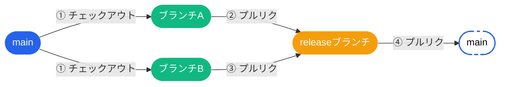
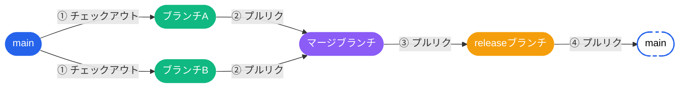
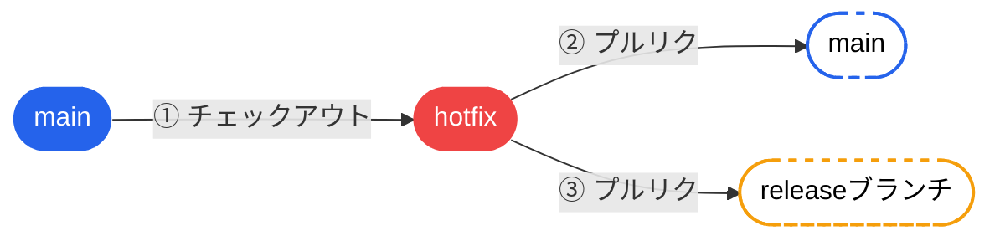

# 🌿 ブランチ戦略ワークフロー

---

## 💡 なぜ `release` ブランチを挟むのか

標準的な GitHub Flow では `main` へのマージが即デプロイに繋がりますが、このプロジェクトでは `main` がトリガーブランチとなっており、変更が加わった時点で本番リリースが実行されます。そのため、`main` への都度マージは適していません。

リリースタグをトリガーとする構成や、手動リリースも検討しましたが、その場合 `main` には常に未リリースの修正が混在する状態となり、緊急修正（hotfix）の起点となるクリーンなブランチが存在しないという問題がありました。

これらの課題を解決するために、`release` ブランチを常設で挟む構成を採用しています。

| 課題 | `release` ブランチで解決できること |
|------|----------------------------------|
| 定例・不定期リリースが混在する | `release` で変更を蓄積し、任意のタイミングで `main` へ反映できる |
| 複数の修正を1リリースにまとめたい | `release` に集約してからまとめてマージできる |
| 緊急修正の起点となるブランチが必要 | 常に本番と同期している `main` から `hotfix` を切り出せる |

---

## 📋 パターン一覧

| # | パターン名 | 用途 |
|---|-----------|------|
| 1 | **通常のフロー** | 機能ブランチを個別に `release` へマージする標準的な流れ |
| 2 | **複数ブランチの一括マージ** | 複数の機能を「マージブランチ」に集約してから `release` へ取り込む |
| 3 | **緊急リリース（Hotfix）** | 本番の緊急修正を `main` と `release` の両方へ即時反映する |

---

## 🟢 パターン 1：通常のフロー

各機能開発ブランチから個別に `release` ブランチへプルリクエストを出す、最も標準的なフローです。

全ての作業ブランチを `main` から派生させることで、`release` と `main` の乖離を防ぎやすくなります。全ブランチが共通のベース（`main`）を起点とし、最終的に `release → main` の1ルートに収束するため、履歴が整理されます。

**ポイント：**
- 各ブランチのレビューを独立して進められる
- マージのタイミングをブランチごとにコントロールできる

---

## 🟣 パターン 2：複数ブランチの一括マージ

複数の機能開発を一度「マージブランチ」に集約し、まとめて `release` へ取り込むフローです。  
リリース直前の結合テストや、依存関係のある機能をセットでデプロイしたいときに有効です。

**ポイント：**
- 複数ブランチを組み合わせた結合テストが容易
- リリース対象のセットを明示的に管理できる

---

## 🔴 パターン 3：緊急リリース（Hotfix）

本番環境での緊急修正時に使うフローです。  
`hotfix` ブランチを `main` から切り出し、修正後は **`main` と `release` の両方** へ直接反映させます。

**ポイント：**
- `release` ブランチには次回リリース予定の修正がすでに含まれているため、通常のリリースサイクルを待たず `main` へ直接マージできることが最大のメリット
- `release` ブランチにも同様に適用するのは、次回リリース時に今回の修正がリグレッションしないようにするため

---

## ✅ プルリクエストでマージすることのメリット

全パターンに共通する運用方針として、全ての作業ブランチをプルリクエスト経由でマージすることを推奨します。

- **コードレビューの強制** — マージ前に必ず他者の目が入り、バグや設計の問題を早期に発見できる
- **変更履歴の可視化** — 何を・なぜ変更したかがPRとして残り、後から追跡しやすい
- **CI/CDとの連携** — PRをトリガーにテストやLintを自動実行し、壊れたコードの混入を防ぐ
- **コンフリクトの早期検出** — PRを出した時点で競合が可視化され、マージ直前の発覚を防げる

---

## 📖 ブランチ一覧

| 色 | ブランチ種別 | 説明 | ライフサイクル |
|---|------------|------|--------------|
| 🔵 `#2563EB` | `main` | 本番リリース済みのベースブランチ | 🔒 常設 |
| 🟡 `#F59E0B` | `release` | リリース準備・QA用のブランチ | 🔒 常設 |
| 🟢 `#10B981` | `feature` | 機能開発用の作業ブランチ | 🔁 都度作成・削除 |
| 🟣 `#8B5CF6` | `merge` | 複数ブランチの一時的な集約ブランチ | 🔁 都度作成・削除 |
| 🔴 `#EF4444` | `hotfix` | 本番緊急修正用ブランチ | 🔁 都度作成・削除 |
| ⬜ 破線枠 | 次の `main` | マージ先を示すターゲットノード | — |
